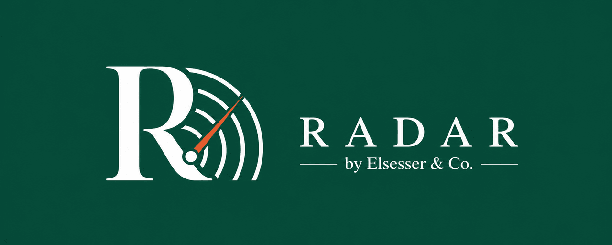

<p align="center">
  
</p>

# Radar Landing

> Маркетинговый лендинг **Radar by Elsesser & Co.** — AI-агент для риелторов, который показывает объявления собственников (Avito, ЦИАН, Яндекс.Недвижимость и др.) раньше конкурентов.

[English version](./README.md)

---

## Стек

- **Next.js 16** (App Router, React 19) — сборка через Turbopack
- **TypeScript** в strict-режиме
- **Tailwind CSS 3** с брендовыми токенами
- **Framer Motion** для анимаций появления
- **Playfair Display** (editorial serif) + **Inter** (body) через `next/font`
- Без сторонних UI-библиотек — все компоненты свои в `web/components/`

## Быстрый старт

```bash
cd web
bun install
bun run dev         # http://localhost:3000
bun run typecheck   # tsc --noEmit
bun run build       # production-сборка
bun run start       # запуск production-сборки
```

> Проект зафиксирован на **Bun** как JS-рантайм и пакетный менеджер.

## Структура проекта

```
radar-landing/
├── README.md            # английская версия (главная)
├── README.ru.md         # этот файл
└── web/                 # Next.js приложение
    ├── app/
    │   ├── layout.tsx
    │   ├── globals.css
    │   └── page.tsx     # сам лендинг
    ├── components/
    │   ├── Logo.tsx
    │   └── landing/     # Hero, Features, Pricing, FAQ и др.
    ├── lib/
    ├── public/
    ├── scripts/
    ├── tailwind.config.ts
    ├── next.config.mjs
    ├── tsconfig.json
    └── package.json
```

## Дизайн-система

Палитра и типографика перенесены один-в-один с сайта агентства elsesserco. Playfair Display italic применяется точечно — цены, имена клиентов, hero-цифры — как сигнатурный приём бренда. Всё остальное — Inter.

| Токен              | Hex             | Роль                                 |
| ------------------ | --------------- | ------------------------------------ |
| `accent`           | `#00736c`       | Фирменный petrol — ссылки, активные  |
| `cta`              | `#d97644`       | Terracotta — только главное действие |
| `navy`             | `#1a2447`       | Заголовки, тёмные хедеры             |
| `paper`            | `#fafaf8`       | Тёплый off-white фон                 |
| `ink` / `ink-soft` | `#333` / `#666` | Текст                                |
| `line`             | `#e0e0e0`       | Разделители                          |

## Лицензия

Proprietary — Elsesser Ind.
